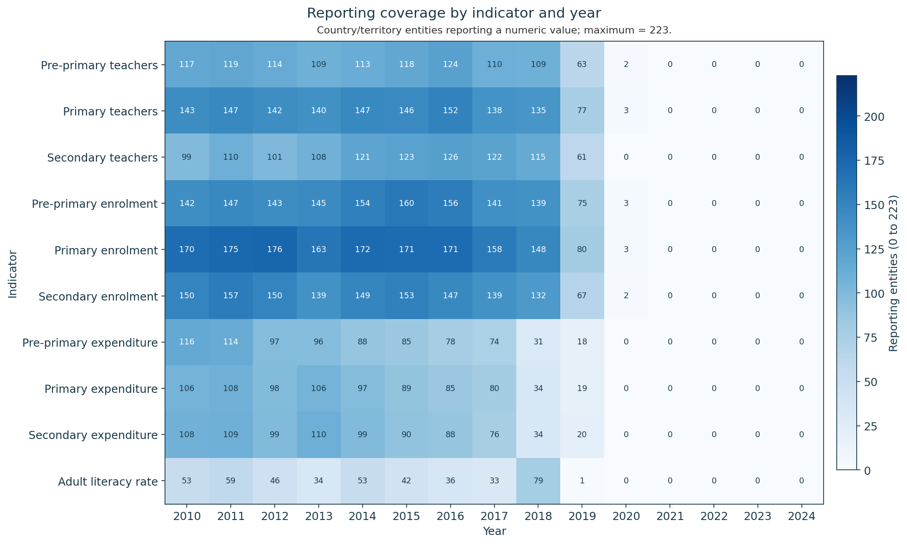
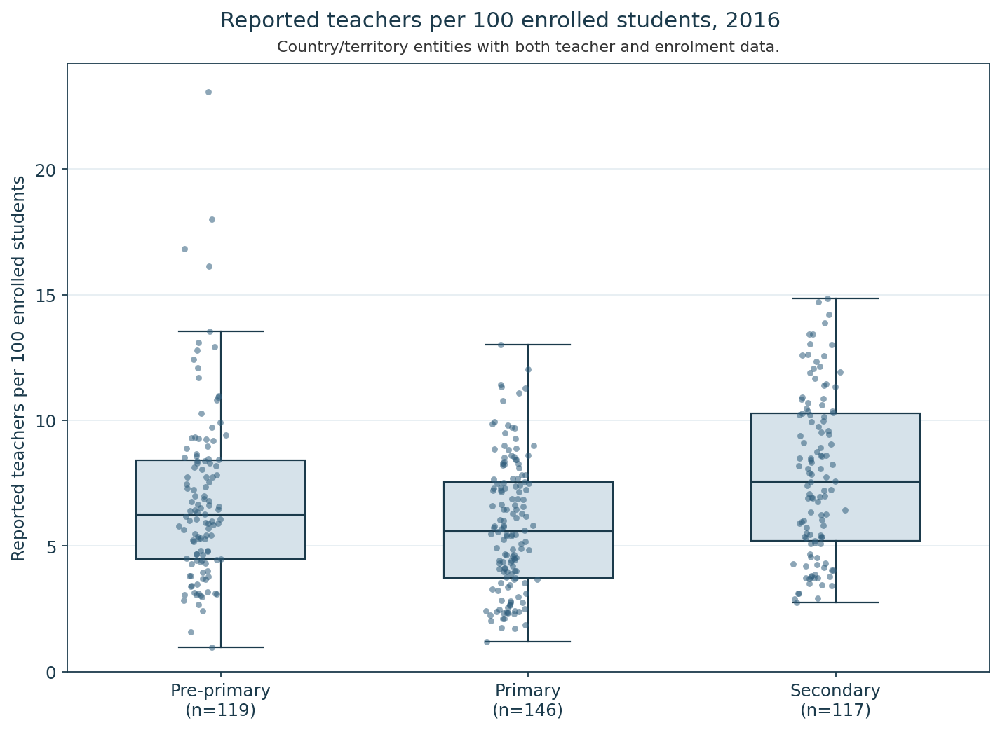
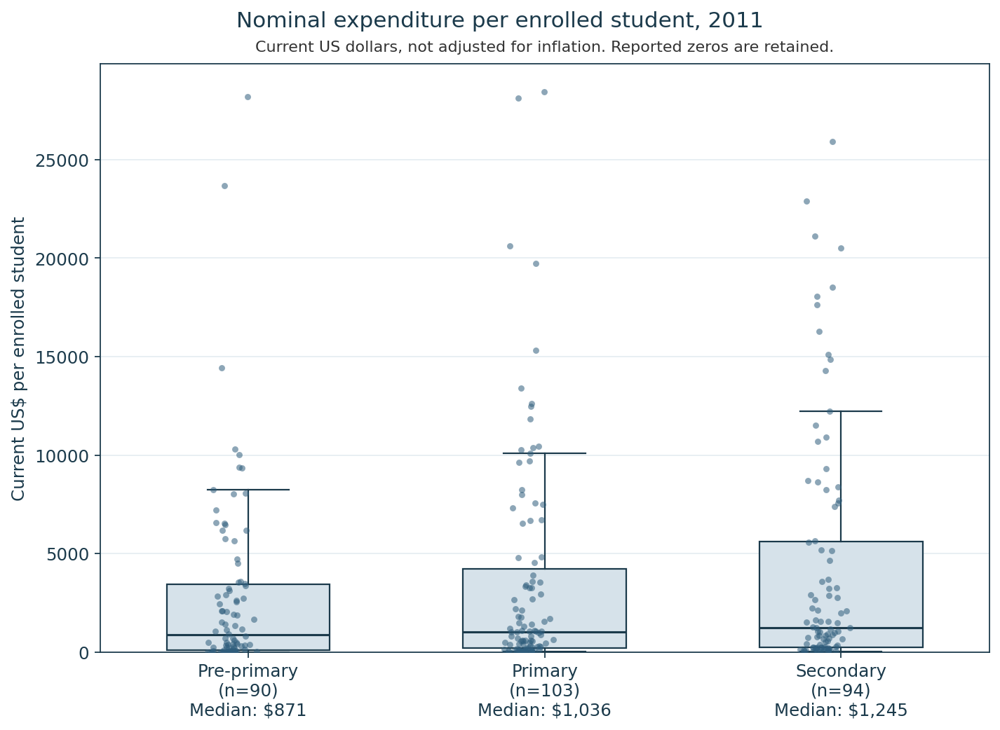

# Global Education Indicators

Reproducible Python analysis of enrolment, teacher counts, adult literacy, and government education expenditure in a locally held education-indicator extract. Reporting coverage and missing data are part of the analysis. The extract does not cover every country, and it is not a complete global record.

Before comparing indicators across entities or years, the pipeline measures who actually reports a numeric value. The file contains 272 entities: 223 classified here as country/territory entities, and 49 aggregate entities that are excluded from those comparisons. It holds 10 indicators and year columns from 2010 through 2024. "Country/territory" includes territories. It is not a list of sovereign states.

The code validates the wide file, reshapes it to one row per entity, indicator, and year, counts reporters, and calculates two same-level ratios only where both inputs are present.

## Key findings

### Reporting coverage varies by indicator

Primary enrolment is the most widely reported series in this extract: 176 of 223 country/territory entities in 2012 (78.92%). Adult literacy is much sparser: 79 entities in 2018, 1 in 2019, and none from 2020 onward. A single cross-year mean of literacy would treat those changing samples as if they were the same population.

No indicator is reported by all 223 country/territory entities. From 2021 through 2024, none of the 10 indicators has a numeric value in this extract. 2020 is sparse rather than empty: 13 country/territory observations in total, limited to a few teacher and enrolment series.



The heatmap keeps every indicator and every year, including cells of zero. Darker blue means more reporting entities. Enrolment is the darkest band in the early 2010s. Literacy stays light, then drops to a single reporter in 2019. The right-hand block is empty.

### Teacher capacity in 2016

In 2016, the median number of reported teachers per 100 enrolled students was 6.27 in pre-primary (n = 119), 5.59 in primary (n = 146), and 7.57 in secondary (n = 117). These are descriptive ratios for entities that reported both a teacher count and enrolment. They are not class sizes, official pupil-teacher ratios, or measures of education quality.



Secondary sits a little higher than primary and pre-primary. High values stay in the plot, including a pre-primary maximum of about 23 teachers per 100 enrolled students. Sample sizes are on the axis.

### Nominal expenditure per enrolled student in 2011

In 2011, median government expenditure per enrolled student was $871 in pre-primary (n = 90), $1,036 in primary (n = 103), and $1,245 in secondary (n = 94). Amounts are current US dollars and are not adjusted for inflation. Seven pre-primary observations are reported zeros, and those zeros stay in the distribution. The comparison is descriptive.



The distributions are skewed. Most entities sit well below the highest values, which is why the medians are labelled under each level rather than read off a mean. The axis is linear, so the reported zeros remain visible at the baseline.

Paired expenditure coverage thins quickly after the middle of the decade: 26, 28, and 28 entities in 2018 for pre-primary, primary, and secondary, then 16, 16, and 17 in 2019, and none from 2020 through 2024.

### Enrolment measures scale

In 2012, the year with the most primary-enrolment reporters, the largest reported systems include India and China. Absolute enrolment describes the size of the reported system. It does not describe education quality or performance.

## Methodology

The source file is wide: one row per entity and series, with a column for each year. The pipeline checks the schema, keeps only the 10 expected series codes, parses year labels, and melts the table to a long form. Blank cells and the token `..` stay missing. Any other non-numeric token stops the run. Identical duplicate entity-series rows are collapsed. Conflicting duplicates stop the run.

Aggregate entities are removed with an explicit code list, not by searching country names. Country/territory comparisons use the remaining 223 entities.

Indicators are selected by exact series code rather than keyword matching, preventing cross-level matches such as pre-primary expenditure entering a primary calculation. Teacher counts are paired only with enrolment at the same level. Expenditure series are paired the same way. A ratio is stored only when the numerator is present, enrolment is present, and enrolment is positive.

Coverage is a full grid of 10 indicators by every year in the extract, including years with zero reporters. There is no cutoff that labels a year usable or unusable. Sample size is reported beside each comparison.

One command writes the tables and the three figures. The same inputs produce the same files.

## Metric definitions

**Reported teachers per enrolled student.** Teacher count divided by enrolment at the same level. The 2016 figure multiplies that ratio by 100 so the axis reads as reported teachers per 100 enrolled students. The stored table keeps the original ratio. The figure is a display scale, not a different definition, and it is not an official pupil-teacher ratio or a class-size statistic.

**Nominal expenditure per enrolled student.** The extract records expenditure in US dollars millions. The metric is that value times 1,000,000, divided by enrolment at the same level. The result is current US dollars per enrolled student. It is not inflation-adjusted.

## Data quality and coverage

Coverage is an output of the analysis, not a filter applied before the results. The heatmap and the coverage table show the reporting sample directly.

The strongest primary-enrolment year still misses 47 of the 223 country/territory entities. Literacy's reporting sample changes from 79 entities in 2018 to one entity in 2019, so a year-to-year literacy average would mostly reflect who filed a number. Expenditure pairs follow the same pattern: the 2011 samples above are the widest in this extract for primary and secondary, and the paired counts are much smaller by 2018 and 2019. Comparisons in this project keep the sample size next to the estimate instead of applying one rule for a "usable" year.

## Data

The local file is `world_bank_education.csv`. On the evidence available here, it is a World Bank-style education extract held locally. The exact database or product, download URL, download date, citation, and licence are not established in this project. The raw CSV is kept out of the repository until provenance and licence are verified. The pipeline does not download data.

A separate file, `countries_data.csv`, was not documented well enough to use. It is not part of this analysis. Region, population, and area are out of scope for that reason. The education file has no stable code link to that metadata in this project.

Place a local copy of the education extract at `data/raw/world_bank_education.csv`. That directory is gitignored apart from a placeholder file.

## Repository layout

```text
.
├── README.md
├── requirements.txt
├── pytest.ini
├── .gitignore
├── data/raw/                 # local extract; contents gitignored except .gitkeep
├── outputs/                  # CSV tables gitignored; three figures tracked
├── src/education_indicators/
│   ├── main.py               # one-command pipeline
│   ├── load.py
│   ├── validate.py
│   ├── tidy.py
│   ├── codes.py              # series codes and the aggregate list
│   ├── analysis.py           # reporting coverage
│   ├── metrics.py            # same-level ratios
│   └── plots.py
└── tests/
```

`src/education_indicators/` is the library: loading, validation, the long table, coverage, ratios, and figures. `tests/` checks those steps with synthetic tables and, when the local extract is present, a smoke test against that file. `outputs/` is where the pipeline writes. `data/raw/` is where the local extract is expected.

## Reproducibility

The tests can be run from a checkout. The analytical pipeline also needs the local education extract. This repository does not supply that file, and it does not fetch one.

From this directory:

```bash
python3 -m venv .venv
source .venv/bin/activate
python -m pip install -r requirements.txt
```

`requirements.txt` lists pandas, pytest, and matplotlib, without version pins.

Put the education CSV at `data/raw/world_bank_education.csv`. If that file is missing, the pipeline stops and prints the expected path.

```bash
PYTHONPATH=src python -m education_indicators.main
python -m pytest
```

`pytest.ini` adds `src` to the Python path and collects `tests/`. Run both commands from this directory. There is no installable package layout beyond that path setting.

## Generated outputs

The pipeline writes these files under `outputs/`. The CSV tables are gitignored and appear after a local run. The three PNG figures are tracked so they render in this README.

Tables:

- `coverage_by_indicator_year.csv` — reporters, missing entities, and coverage for each indicator and year
- `teacher_capacity.csv` — reported teachers per enrolled student
- `expenditure_per_student.csv` — nominal US dollars per enrolled student
- `paired_coverage.csv` — how many entities have both sides of each ratio
- `literacy_coverage_2010_2019.csv` — adult-literacy reporting counts, not a literacy average
- `primary_enrolment_scale_top10.csv` — ten largest reported primary systems in the highest-coverage year

Figures:

- `reporting_coverage_heatmap.png`
- `teacher_capacity_2016.png`
- `expenditure_per_student_2011.png`

The long tidy table is not written to disk.

## Tests

The suite currently has 55 passing tests. They cover schema validation, missing-value handling, duplicate conflicts, exact indicator pairing, aggregate exclusion, enrolment checks before a ratio is stored, paired coverage, deterministic table construction, and the year, level, and sample-size choices used by the figures. The smoke test runs only when the local extract is present.

## Limitations

Reporting is incomplete and uneven, so each comparison describes the entities that filed a number in that year.

Country/territory membership is whatever remains after an explicit aggregate-code list. Territories stay in the comparison set. A new grouping code in a later extract would be treated as a country/territory entity until that list is reviewed.

Expenditure is nominal current US dollars. Teacher capacity is a descriptive ratio of reported teachers to reported enrolment. Neither is adjusted into an official quality, class-size, or price-comparable series.

The set of reporting entities changes by indicator and year. Coverage is shown so that change stays visible.

The raw extract is not yet documented well enough to redistribute. Population, region, and area are omitted because the separate metadata file lacks a documented source and a stable code key.
